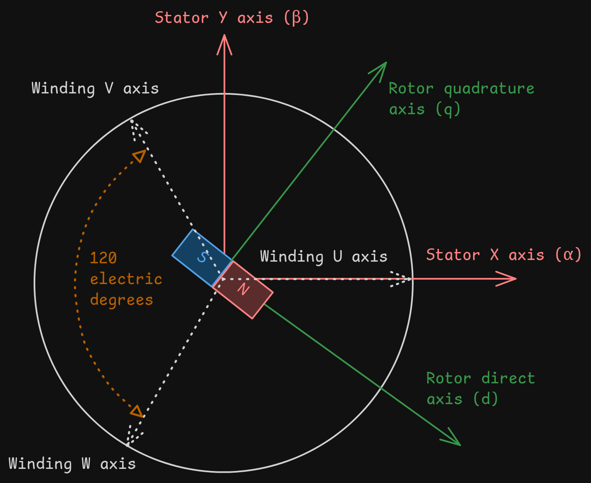

# Field-Oriented Control

Stolen from [my motor controller project](https://github.com/Glitch752/focMotorController) :)

Field oriented control is a mechanism to control brushless DC motors that guarantees torque will always be applied directly perpendicular to the motor. It increases the efficiency, maximum speed, and power output of controlled motors. However, it's also relatively expensive to calculate and suffers from MOSFET switching losses because we must use PWM control to generate an effective sine wave.

### Definitions and acronyms
- **Motor**: A device that converts electrical energy into mechanical energy. Motors typically use moving permanent magnets and fixed electromagnets to generate a magnetic field that causes the rotor to spin.
  - **Winding**: A coil of wire that generates a magnetic field when current flows through it.
  - **Inductor**: Another name for a winding, typically used in the context of inductors that store energy in a magnetic field.
  - **Phase**: A set of windings in a motor that is independently controlled. Brushless motors typically have three phases, which are often referred to as A, B, and C or U, V, and W.
  - **Rotor**: The *rot*ating part of the motor containing permanent magnets. This is the part that spins.
    - **Poles**: The number of permanent magnets attached to the rotor. This isn't necessarily a multiple of the number of phases, but should be a multiple of 2 (since two identical magnet poles can't be beside each other).
  - **Stator**: The *stat*ionary part of the motor containing the windings. This is the part that generates the magnetic field. In a 3-phase motor, the stator has 3 sets of windings, each 120 electric degrees apart.
    - **Slots**: The number of coils on the stator. Motors will have a number of slots that is a multiple of the number of phases.
  - **BLDC**: Brushless DC. Brushed motors have physical contacts that dictate when phases are activated, while brushless motors rely on electrical signals to control the phases. Brushless motors can be faster, more reliable, and more efficient, but this comes at the cost of complexity.[1](#footnote-1)
  - **PMSM**: Permanent Magnet Synchronous Motors. The uses of this term are somewhat murky and confused with BLDC, so I will refrain from using it to avoid confusion.[2](#footnote-2)
  - **Mechanical angle**: The physical angle of the rotor in the motor; 1 revolution of the rotor is 360 degrees. The mechanical angle is used for position and speed feedback.
  - **Electrical angle**: The electrical angle describes the position of the rotor relative to the stator's magnetic field. It cycles faster than the mechanical angle by a factor equal to the number of pole pairs. The electrical angle is used for control calculations (e.g. it's the angle used in park and clarke transformations; see below).
- **FOC**: Field-oriented control, a method of controlling brushless motors that uses current-based feedback to apply torque directly perpendicular to the rotor.
- **Inverter**: Components that convert DC power to AC power. In our case, the circuitry that converts the motor controller's input voltage to phase voltages.
  - **MOSFET**: Metal-Oxide-Semiconductor Field-Effect Transistor; a particular type of transistor that can effectively act as a switch when appropriate signals are applied. 6 MOSFETs are used for BLDC motor control: one for ground and one for voltage of each phase.
  - **Gate driver / FET driver**: A circuit that controls MOSFETs, providing the necessary voltage while decoupling the microcontroller from the relatively high current draw of switching MOSFETs.
  - **Half bridge**: A circuit that controls two MOSFETs to switch a phase between voltage and ground. Half bridges are used for each phase in BLDC motor control.
- **Encoder**: A device that measures the position of the rotor relative to the stator. Accurate position measurement is crucial for FOC so we know where to apply torque.
  - **Hall effect sensor**: A type of sensor that detects magnetic fields.
  - **Quadrature encoder**: A type of encoder that uses two signals to determine the position of the rotor. It can detect both position and direction of rotation. Quadrature encoders can use hall sensors, optical sensors, or other methods.
    - **A/B channels**: Quadrature encoders have two primary outputs, A and B, which are 90 degrees out of phase. This communicates both velocity and direction of rotation.
    - **C channel / index**: Some quadrature encoders (including those we rely on) have a third channel, C, which indicates a specific position of the rotor. This is used for homing the rotor to find its initial position.
- **PWM**: Pulse-width modulation. A method of controlling the amount of power delivered by quicking switching something on and off.
  - **Duty cycle**: The percentage of time that a signal is on compared to the total time. For example, a 25% duty cycle means the signal is on for 25% of the time and off for 75% of the time.
  - **SVM**: Space vector modulation. An algorithm for effectively creating AC waveforms through PWM signals. SVM is commonly used for BLDC motor control because it reduces noise and vibration compared to more naive approaches.
- **Driving frequency**: Generally, the frequency of PWM pulses sent to the half bridge drivers. A higher driving frequency creates a smoother output signal but requires faster and more expensive hardware. Generally in the range of 20 to 80 kHz.
- **Control frequency**: The frequency of the control system driving the output voltages. Control systems generally operate around 1 to 5 kHz.
- **Inrunner/outrunner**: Two types of brushless motors that differ in how the stator and rotor are arranged.
  - **Inrunner**: The rotor is inside the stator, which typically contains large windings pointing inward. Inrunner motors generally have a higher maximum speed and efficiency.
  - **Outrunner**: The rotor is outside the stator, which typically contains smaller windings pointing outward. In some cases, this means the rotor is the outer body of the motor. In outrunner motors, the rotor is sometimes also called a can. Outrunner motors generally have a higher torque output.
- **Flux**: Shorthand for magnetic flux linkage. Magnetic flux linkage can be thought of as the "magnetic field strength" in the motor. For PMSM control, our reference flux is 0 (but we still need to control it to keep it there).
- There are many coordinate systems used for BLDC control; see [figure 1](#figure-1-a-diagram-of-coordinate-systems-used-in-foc). Here are the most important ones and their common names:
  - **Stator X axis / alpha**: The "horizontal" (on a side profile) axis of the motor stator.
  - **Stator Y axis / beta**: The "vertical" (on a side profile) axis of the motor stator.
  - **Winding U, V, and W axes**: The axes pointing outwards for the three phases of the motor, 120 degrees offset from each other. Axis U is typically aligned with the stator X axis.
  - **Rotor direct axis / d**: The axis of the rotor that is parallel to the rotor's magnetic field that generates flux.
  - **Rotor quadrature axis / q**: The axis of the rotor that is perpendicular to the rotor's magnetic field that generates torque.
- **Electromotive force / back EMF**: The voltage generated by the motor itself while spinning.[3](#footnote-3)
- Transformations are used in motor control to make manipulating the signals simpler.
  - **Clarke transformation**: Also known as the alpha-beta transformation; converts the three-phase stator currents u, v, and w into stator axes alpha and beta.
  - **Park transformation**: Also known as the direct-quadrature-zero transformation; converts stator-aligned components into rotor axes q and d with respect to the motor's rotating magnetic field.
- **Proportional-integral (PI) controller**: A feedback-based control mechanism to regulate processes that require dynamic adjustment or can't be precisely modelled mathematically. PI controllers are used to regulate rotor axis (q and d) currents by controlling the maximum PWM duty cycle for each phase.[4](#footnote-4)

### FOC process

The broad overview of FOC control is as follows:
1. Gather the measured position of the rotor using the encoder.
2. Transform phases into the rotor coordinate system.
3. Calculate the required current in the rotor quadrature axis (q) to generate the desired torque.
4. Calculate the required current in the rotor direct axis (d) to generate the desired magnetic field.
5. Transform the rotor coordinate system back to the phases' coordinate systems.
6. Calculate the required voltage to apply to each phase to generate the desired current.
7. Apply the calculated voltage to each phase using PWM.
8. Repeat at a high frequency.

From [this great presentation](https://www.ti.com/lit/ml/slyp711/slyp711.pdf).  

There are a few important things to note:
- We can't track the encoder position fast enough to respond accurately to the rotor position at high speeds,
  so we must perform latency compensation of some sort.
- The current in the rotor direct axis (d) is typically set to zero, meaning we only control the rotor quadrature axis (q).
  This is because the d-axis current doesn't generate torque, so we don't care about it for most applications.
- This doesn't account for current limiting, which is a whole separate topic that I honestly
  don't understand very well. Currently, I naively clamp the applied current to a maximum value.

### Footnotes

<h4 id="footnote-1">1 "Brushless DC"</h4>
Confusingly, "brushless DC motor control" is often used to refer to brushless motors that are controlled with DC voltage through a motor controller, even though the motor itself is an AC motor. This is because the motor controller generates a sine wave using PWM signals, which is then applied to the motor phases.

<h4 id="footnote-2">2 "Permanent Magnet Synchronous Motors. The uses of this term are somewhat murky and confused with BLDC [...]"</h4>
Technically, brushless motors can also be switched reluctance motors or induction motors (also known as asynchronous motors). However, the majority of brushless DC motors are PMSM. Synchronous motors are a subset of brushless motors whose speed is independent of the load.

<h4 id="footnote-3">3 "Back EMF is the voltage generated by the motor itself while spinning"</h4>
When brushless motors spin, the rotor generates current in the stator that opposes the applied voltage. Back EMF is linearly proportional to the rotational speed of the motor, so it's one of the forces that limits brushless motors' maximum speed.  
Back EMF is sometimes used to determine the position and speed of brushless motors in sensorless control, but almost never for FOC because it's not precise enough. It can also be used to our advantage for "braking", which entails shorting the phases together to make the motor resist rotation.  
  
<h4 id="footnote-4">4 "PI controllers are a feedback-based control mechanism [...]"</h4>
PI controllers take the error between the current and desired state as an input and adjust the output based on the error. They have two components (hence the name): a proportional component that linearly adjusts the output based on the error, and an integral component that accumulates error over time. The two components are added to get the final output.  
PI controllers are a subset of the more general PID controllers, which also include a derivative component that predicts future error based on the rate of change of the error. In a PI controller, the components serve different purposes; the proportional component provides immediate response to error, while the integral component helps eliminate steady-state error by adjusting the output based on accumulated error over time.  

### Figures
#### Figure 1: A diagram of coordinate systems used in FOC
